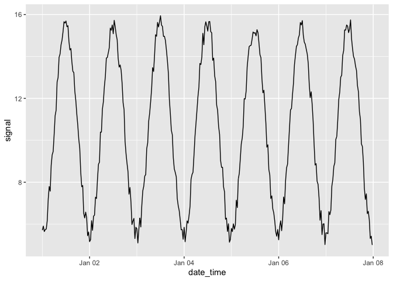
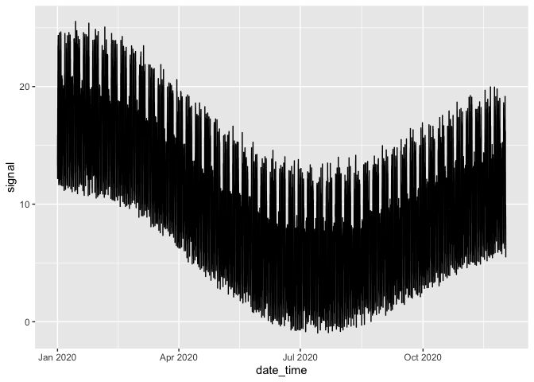

<!-- README.md is generated from README.Rmd. Please edit that file -->

# rsatz

<!-- badges: start -->

<!-- badges: end -->

rsatz is a minimal library to simply make fake time series data in a
tidy way

## Installation

You can install the released version of rsatz from
[CRAN](https://CRAN.R-project.org) with:

``` r
install.packages("rsatz")
```

## Example

This is a basic example which shows you how to make a very simple data
set:

``` r
library(rsatz)
library(tidyverse)
#> ── Attaching packages ──────────────────────────────────────────── tidyverse 1.3.0 ──
#> ✔ ggplot2 3.2.1     ✔ purrr   0.3.3
#> ✔ tibble  2.1.3     ✔ dplyr   0.8.4
#> ✔ tidyr   1.0.2     ✔ stringr 1.4.0
#> ✔ readr   1.3.1     ✔ forcats 0.4.0
#> ── Conflicts ─────────────────────────────────────────────── tidyverse_conflicts() ──
#> ✖ dplyr::filter() masks stats::filter()
#> ✖ dplyr::lag()    masks stats::lag()

generate_signal(7, amplitude = 5) %>% 
  shift_signal(10) %>% 
  add_noise() %>% 
  ggplot(aes(date_time, signal)) +
  geom_line()
```



Or something more complicated.

``` r
generate_signal(7 * 4 * 12, amplitude = 5) %>% 
  shift_signal(centre_point = 10) %>% 
  make_trend(start = 7 * 4 * 48, strength = 5) %>%
  make_trend(start = 7 * 4 * 48 * 2, strength = -10) %>%
  make_weekends() %>%  
  make_anomalies(n = 0.2) %>% 
  add_seasonality() %>% 
  add_noise(low = 1, high = 5) %>% 
  ggplot(aes(date_time, signal)) +
  geom_line()
#> Warning: Current temporal ordering may yield unexpected results.
#> Suggest to sort by ``, `date_time` first.
```


